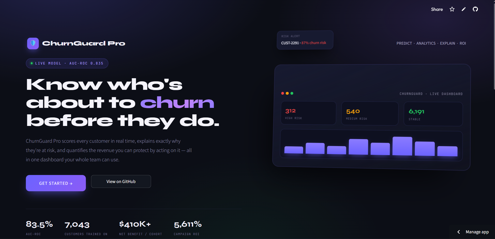
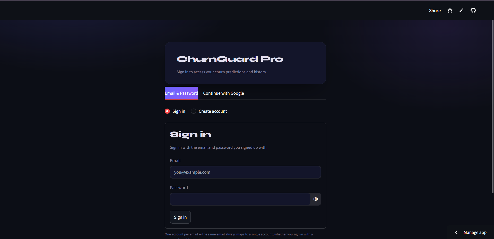
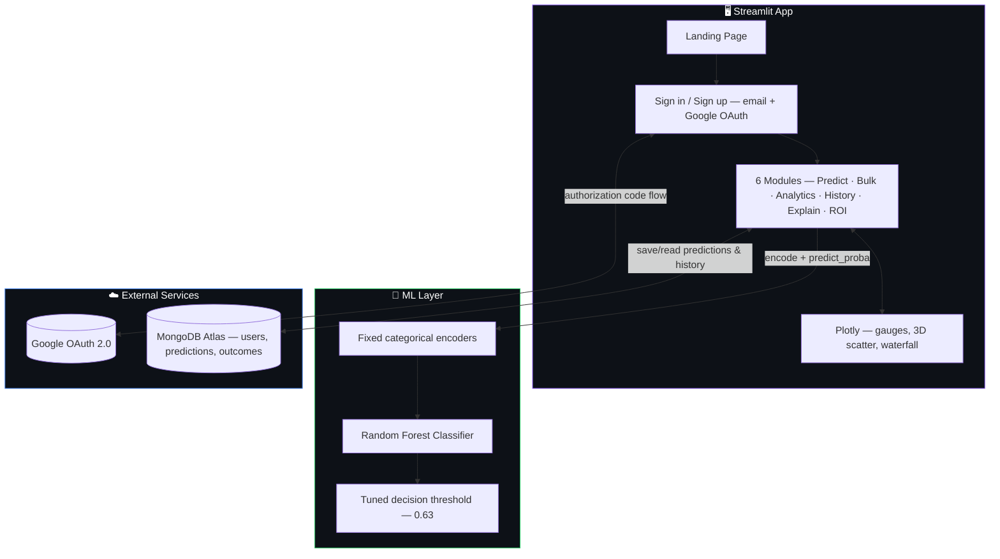
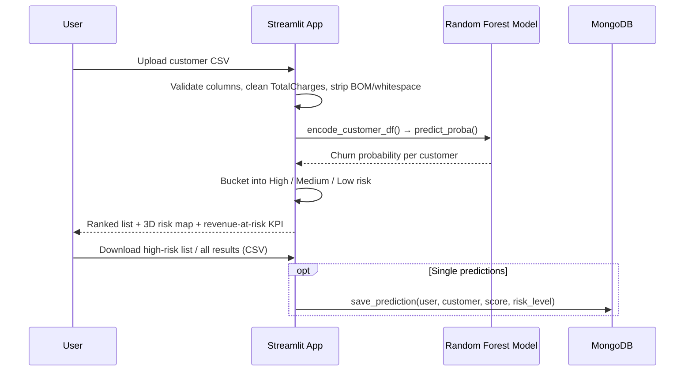
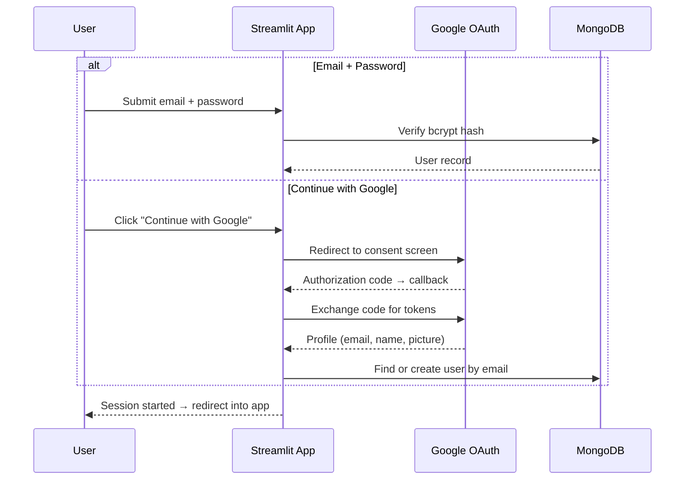

<div align="center">


# ChurnGuard Pro
### AI-Powered Customer Churn Intelligence Platform
**Upload a customer, a CSV, or a whole portfolio → get a churn-risk score, an explanation, and a dollar figure for what it's worth to act on it.**

[](https://churnguard.streamlit.app)

<br/>


</div>

---

## 🚨 The Problem

Every subscription business asks the same three questions, usually too late:

> *Which customers are about to leave? Why are they leaving? And is it actually worth spending money to stop them?*

Churn dashboards built for data scientists answer the first question and stop there. Nobody in sales, support, or finance can act on a SHAP plot. **ChurnGuard Pro exists to answer all three questions — for one customer or ten thousand — in a format a retention team can act on the same day.**

---

## 💡 What ChurnGuard Pro Does

<div align="center">

| Step | Stage | What happens |
|:---:|---|---|
| 1️⃣ | 🎯 **Score** | Enter one customer, or upload a CSV of thousands — a tuned Random Forest scores every row |
| 2️⃣ | 🚦 **Rank** | Every customer is bucketed into High / Medium / Low risk against a precision-tuned threshold |
| 3️⃣ | 🕸️ **Map** | An interactive 3D scatter plots tenure × monthly charges × churn probability, so risk clusters are visible, not just listed |
| 4️⃣ | 🔍 **Explain** | Each prediction comes with the plain-English risk factors driving it — contract type, tenure, service mix |
| 5️⃣ | 🕓 **Track** | Every prediction is saved per-user in MongoDB, so you can log real retention outcomes over time |
| 6️⃣ | 💰 **Justify** | The ROI Calculator turns a batch of predictions into campaign cost, revenue protected, and net ROI% — before you spend a rupee |

</div>

No spinner-and-hope waiting — bulk predictions on thousands of rows score in seconds, and every chart renders inline as soon as a file is uploaded.

---

## 🧩 Features

**Core pipeline**

| Feature | Description |
|---|---|
| 🔐 **Full Auth** | Email/password *or* "Continue with Google" — every user's predictions and history are tied to their account in MongoDB, one account per email regardless of sign-in method |
| 🏠 **Landing Page** | Public marketing home page with a live-styled 3D dashboard mockup and feature grid, before anyone hits the sign-in wall |
| 🎯 **Single Predict** | Score one customer instantly — probability, risk tier, a live gauge chart, and a recommended retention action with estimated LTV at risk |
| 📊 **Bulk Predict** | Upload a CSV of customers — get a ranked, filterable, exportable at-risk list plus an interactive **3D risk map** (tenure × monthly charges × churn %) |
| 📈 **Analytics Dashboard** | Portfolio-level churn patterns by contract type, with the same 3D scatter view at the segment level |
| 🕓 **My History** | Every saved prediction, searchable per customer, with retention-outcome tracking and effectiveness stats over time |
| 🔍 **Explainability** | Feature-level breakdown of *why* a customer is flagged — not just a score |
| 💰 **ROI Calculator** | Cost, save-rate, and LTV inputs roll up into net benefit, an ROI gauge, and a cost/revenue/net-benefit waterfall chart |

---

## 🧭 Product Walkthrough

### 1. Landing Page
A public hero page with a 3D-tilted CSS dashboard mockup and live stats — before anyone signs in.



### 2. Sign In / Create Account
Email + password, or one click with **Continue with Google** — accounts merge by email either way.



### 3. Single Predict
Score one customer instantly with a live gauge and a plain-English retention recommendation.


### 4. Bulk Predict
Upload a CSV, get a ranked at-risk list plus an interactive 3D risk map of the whole batch.


### 5. Analytics Dashboard
Portfolio-level churn patterns by contract, tenure, and service — spot the segments that matter.


### 6. Explainability
Every prediction comes with the factors actually driving it, not just a number.


### 7. ROI Calculator
Turn a batch of predictions into a dollar figure — cost, revenue protected, and ROI %.


> **Adding your own screenshots:** drop image files into `docs/screenshots/`, then reference them anywhere in this README with ``. GitHub renders them automatically.

---

## 🏗 System Architecture



### Bulk Prediction Flow



### Sign-In Flow (email + Google, merged by email)



---

## ⚖️ Model Performance

| Metric | Value |
|---|---|
| **Algorithm** | Random Forest Classifier (GridSearchCV-tuned, 540 configurations) |
| **AUC-ROC** | 0.8353 |
| **Precision** | 60.4% |
| **Recall** | 62.3% |
| **F1 Score** | 0.6132 |
| **Decision threshold** | 0.63 (tuned from default 0.50) |
| **Overfit gap** | Reduced from 0.112 → 0.013 via 5-fold stratified CV + SMOTE |
| **Trained on** | 7,043 telecom customers (IBM Telco Customer Churn dataset) |

On a typical test cohort, the ROI Calculator estimates **$410,000+ net benefit** and **5,611% campaign ROI** from acting on the flagged at-risk list.

---

## 🛠 Tech Stack

**Application**
- Python + Streamlit — UI, routing between landing/auth/app via `st.session_state`
- Plotly — gauge indicators, interactive 3D scatter plots, waterfall charts
- Matplotlib — static analytics charts (feature importance, ROC/PR curves)
- Pandas / NumPy — data cleaning, encoding, batch scoring

**Model**
- scikit-learn — Random Forest, GridSearchCV hyperparameter tuning
- imbalanced-learn (SMOTE) — class imbalance handling during training
- Fixed categorical encoding maps matched to training-time ordering — bulk uploads never fit a fresh encoder per file

**Auth & Data**
- `google-auth-oauthlib` — full OAuth 2.0 authorization-code flow for "Continue with Google"
- `bcrypt` — password hashing for email/password accounts
- `pymongo` + MongoDB Atlas — per-user predictions, outcomes, and account data

---

## 🚀 Deployment

ChurnGuard Pro runs on **Streamlit Community Cloud**, deployed straight from `main`.

| Piece | How |
|---|---|
| **Hosting** | Streamlit Community Cloud, auto-redeploys on every push to `main` |
| **Python version** | Pinned to 3.11/3.12 in app settings — newer default runtimes lack prebuilt wheels for pandas/numpy and fail building from source |
| **Database** | MongoDB Atlas (free tier) |
| **Secrets** | `GOOGLE_CLIENT_ID`, `GOOGLE_CLIENT_SECRET`, `REDIRECT_URI`, `MONGO_URI`, `COOKIE_KEY` — set via the Streamlit Cloud dashboard's **Secrets** panel, never committed to git |
| **OAuth redirect** | The deployed app URL must be added as an **Authorized redirect URI** on the Google Cloud OAuth client, exactly matching `REDIRECT_URI` in secrets |

---

## 🌐 Live Demo

🔗 **[churnguard.streamlit.app](https://churnguard.streamlit.app)**

**Try it yourself:**
1. From the landing page, click **Get Started** → sign up with email or Google
2. **Module 01** — score a single customer and see the live risk gauge
3. **Module 02** — download the CSV template, upload it back, and explore the interactive 3D risk map
4. **Module 03** — see portfolio-level churn patterns by contract type
5. **Module 06** — plug in a campaign cost and save-rate assumption and watch the ROI gauge move

> First load may take a few seconds if the app has been idle — subsequent requests are fast.

---

## 💻 Local Setup

```bash
# 1. Clone and enter the project
git clone https://github.com/saumyadwiv/churnguard.git
cd churnguard

# 2. Create and activate a virtual environment
python -m venv venv
venv\Scripts\activate        # Windows
# source venv/bin/activate   # macOS/Linux

# 3. Install dependencies
pip install -r requirements.txt

# 4. Configure secrets
copy .streamlit\secrets.toml.example .streamlit\secrets.toml   # Windows
# cp .streamlit/secrets.toml.example .streamlit/secrets.toml   # macOS/Linux
# then fill in MONGO_URI, GOOGLE_CLIENT_ID, GOOGLE_CLIENT_SECRET, REDIRECT_URI, COOKIE_KEY

# 5. Run
streamlit run app.py
```

Open **http://localhost:8501**, sign up, and run your first prediction.

### Required secrets (`.streamlit/secrets.toml`)

| Variable | Purpose |
|---|---|
| `MONGO_URI` | MongoDB Atlas connection string |
| `GOOGLE_CLIENT_ID` / `GOOGLE_CLIENT_SECRET` | Google OAuth client credentials |
| `REDIRECT_URI` | `http://localhost:8501` locally, your deployed URL in production |
| `COOKIE_KEY` | Random long string used for session signing |

`secrets.toml` is git-ignored — never commit real credentials. Only `secrets.toml.example` (placeholders) is tracked.

---

## 📂 Repo Layout

```
churnguard/
├── app.py                        Main app — 6 modules, page config, sidebar, CSS
├── auth.py                       Email/password + Google OAuth sign-in
├── landing.py                    Public marketing home page
├── db.py                         MongoDB persistence (users, predictions, outcomes)
├── churn_model_final.pkl         Trained Random Forest model
├── feature_names.pkl             Ordered feature list the model expects
├── metrics.json                  Model evaluation metrics
├── sample_customers.csv          Example bulk-upload file
├── requirements.txt
├── .streamlit/
│   └── secrets.toml.example      Template for local secrets (never the real file)
├── data/
│   └── telco_churn.csv           Training dataset (IBM Telco Customer Churn)
└── reports/
    ├── model_card.md
    ├── evaluation_report.md / .json
    ├── data_report.md
    └── figures/                  Confusion matrix, ROC/PR curves, feature importance
```

---

<div align="center">

*Every customer has a story. ChurnGuard Pro scores it, explains it, and prices it — before they leave.*

</div>